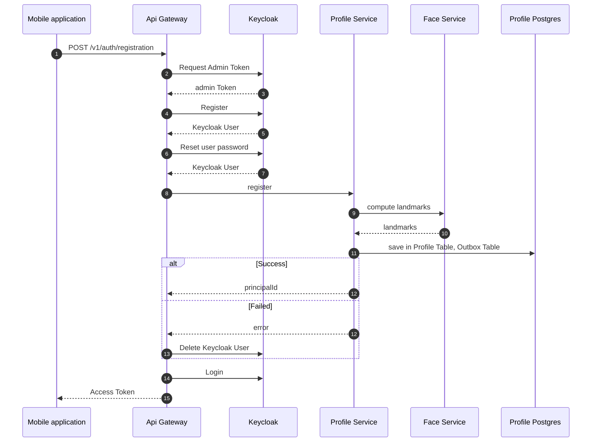
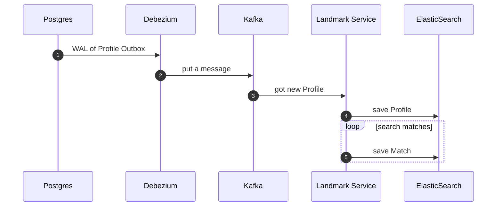
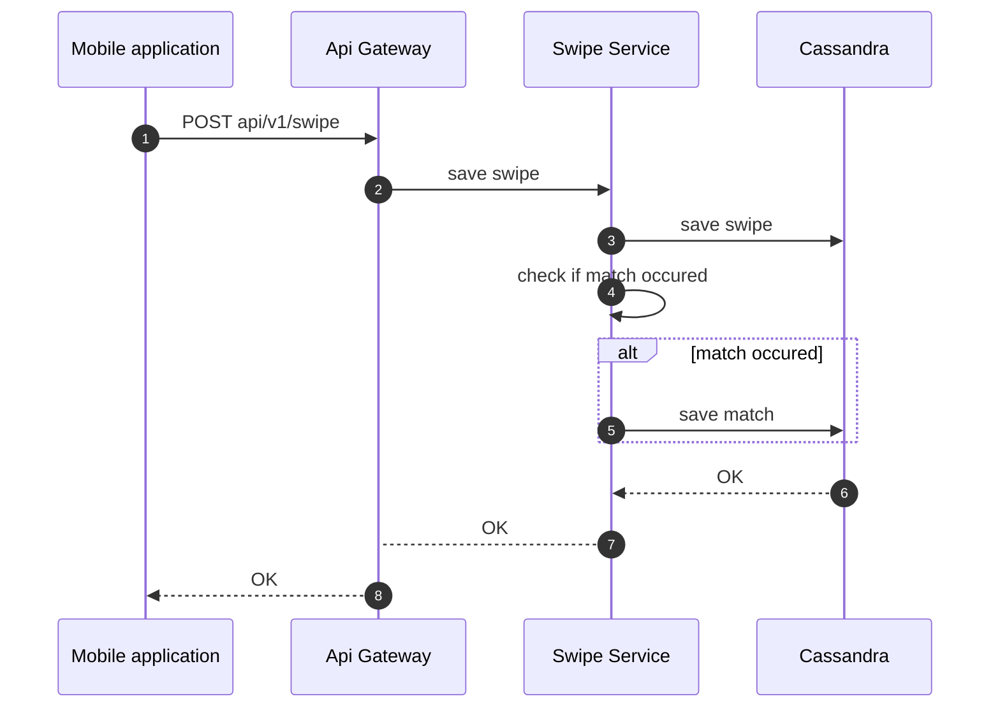

# Soulmate System

A modern microservices-based dating platform that leverages facial recognition technology for intelligent matching. The system uses Spring Boot microservices architecture with event-driven communication and comprehensive observability.

## 🏗️ Architecture Overview

The Soulmate System consists of several interconnected microservices:

- **API Gateway** - Central entry point for all client requests
- **User Service** - Profile management, authentication, and photo handling
- **Swipe Service** - User interaction and matching logic
- **Landmark Service** - Facial recognition and matching algorithms
- **Common** - Shared libraries and utilities

## 🚀 Key Features

- **Facial Recognition Matching**: Advanced facial landmark detection for compatible partner suggestions
- **Event-Driven Architecture**: Real-time communication using Kafka and Debezium
- **Microservices Design**: Scalable, independently deployable services
- **Comprehensive Testing**: Integration tests with Testcontainers for all services
- **Observability**: Full monitoring with OpenTelemetry, Prometheus, and distributed tracing
- **Security**: OAuth2/JWT authentication with Keycloak integration
- **Object Storage**: MinIO for efficient photo storage and retrieval

## 📋 Services

### User Service
- **Port**: 8082
- **Database**: PostgreSQL with Liquibase migrations
- **Features**:
  - User registration and profile management
  - Photo upload and validation
  - Soft/hard delete functionality
  - Outbox pattern for event publishing
  - Comprehensive integration testing

### Swipe Service
- **Database**: Cassandra for high-performance swipe operations
- **Features**:
  - Real-time swipe processing
  - Match detection algorithm
  - Partition-based data organization

### Landmark Service
- **Features**:
  - Facial landmark extraction
  - Profile matching algorithms
  - Elasticsearch integration for search

### API Gateway
- **Features**:
  - Request routing and load balancing
  - Authentication proxy
  - Rate limiting and security

## 🛠️ Technology Stack

### Backend
- **Java 24** with Spring Boot 3.5.0
- **Spring Cloud** for microservices patterns
- **PostgreSQL** with Hibernate Envers for auditing
- **Cassandra** for high-throughput data
- **Kafka** for event streaming
- **Debezium** for CDC (Change Data Capture)
- **Elasticsearch** for search functionality
- **MinIO** for object storage
- **Keycloak** for authentication

### Development & Testing
- **Testcontainers** for integration testing
- **JUnit 5** for unit testing
- **WireMock** for service mocking
- **Docker** for containerization
- **Gradle** for build management

### Observability
- **OpenTelemetry** for distributed tracing
- **Prometheus** for metrics collection
- **Micrometer** for application metrics
- **Logstash** for structured logging

## 🔄 System Workflows

### Registration Flow



### Event Processing Flow



### Swipe & Match Flow



## 🔧 Matching Logic

1. First swipe creates partition "A:B" with swipe A→B
2. Second swipe creates partition "B:A" with swipe B→A and checking reversed swipe A:B

User A swipes User B:
1. Creates record in partition "A:B"
    - userPair = "A:B"
    - userId = A
    - swipedUserId = B

User B swipes User A:
1. Creates record in partition "B:A"
    - userPair = "B:A"
    - userId = B
    - swipedUserId = A

2. Checks for existing like in partition "A:B"
    - hasMatch("A:B", A, B) → finds A→B swipe
    - Creates match! ✓

## 🚦 Getting Started

### Prerequisites
- Java 24
- Docker & Docker Compose
- Gradle 8.0+
- PostgreSQL 15+
- Kafka 3.8+
- MinIO

### Local Development

1. **Clone the repository**
   ```bash
   git clone https://github.com/maxbpro/soulmate-system.git
   cd soulmate-system
   ```

2. **Start infrastructure services**
   ```bash
   docker-compose up -d
   ```

3. **Build all services**
   ```bash
   ./gradlew build
   ```

4. **Run individual services**
   ```bash
   # User Service
   cd user-service
   ./gradlew bootRun
   
   # Other services...
   ```

### Environment Variables

Key environment variables for configuration:

```yaml
# Database
POSTGRES_HOST=localhost
POSTGRES_PORT=5432
POSTGRES_USER=postgres
POSTGRES_PASSWORD=postgres

# Kafka
KAFKA_BOOTSTRAP_SERVERS=localhost:9092

# MinIO
MINIO_ENDPOINT=http://127.0.0.1:9000
MINIO_ACCESS_KEY=user
MINIO_SECRET_KEY=password

# Keycloak
RESOURCE_SERVER_ISSUER_URI=http://localhost:8080/realms/customer
RESOURCE_SERVER_JWK_SET_URI=http://localhost:8080/realms/customer/protocol/openid-connect/certs
```

## 🧪 Testing

The project includes comprehensive testing:

### Integration Tests
- **User Service**: Full integration testing with Testcontainers
- **Database Testing**: PostgreSQL, Kafka, MinIO, WireMock containers
- **API Testing**: Complete endpoint coverage
- **Event Testing**: Kafka event verification

### Running Tests
```bash
# Run all tests
./gradlew test

# Run integration tests
./gradlew test --tests "*IntegrationTest"

# Run with specific profile
./gradlew test -Dspring.profiles.active=test
```

## 📊 Monitoring & Observability

### Metrics
- **Prometheus**: `/actuator/prometheus`
- **Health Checks**: `/actuator/health`
- **Custom Metrics**: Business and performance metrics

### Tracing
- **OpenTelemetry**: Distributed tracing across services
- **Jaeger/Zipkin**: Trace visualization
- **OTLP Export**: Standardized trace export

### Logging
- **Structured Logging**: JSON format with Logstash
- **Correlation IDs**: Request tracking across services
- **Log Levels**: Configurable per environment

## 🔐 Security

- **OAuth2/JWT**: Token-based authentication
- **Keycloak**: Identity and access management
- **Resource Server**: Spring Security integration
- **CORS**: Cross-origin resource sharing
- **Input Validation**: Comprehensive request validation

## 📦 Deployment

### Docker
Each service includes a Dockerfile for containerization:

```bash
# Build service image
docker build -t soulmate/user-service ./user-service

# Run with Docker Compose
docker-compose up user-service
```

### Kubernetes
Kubernetes manifests are provided in the `k8s/` directories:

```bash
# Deploy to Kubernetes
kubectl apply -f user-service/k8s/
```

## 🤝 Contributing

1. Fork the repository
2. Create a feature branch
3. Make your changes
4. Add tests for new functionality
5. Run the test suite
6. Submit a pull request

## 📄 License

This project is licensed under the MIT License - see the [LICENSE](LICENSE) file for details.

## 📞 Support

For questions and support:
- Create an issue in the GitHub repository
- Check the documentation in each service's README
- Review the integration tests for usage examples

---

**Built with ❤️ using modern microservices architecture**