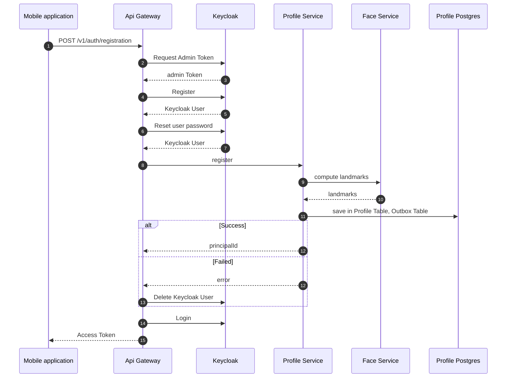
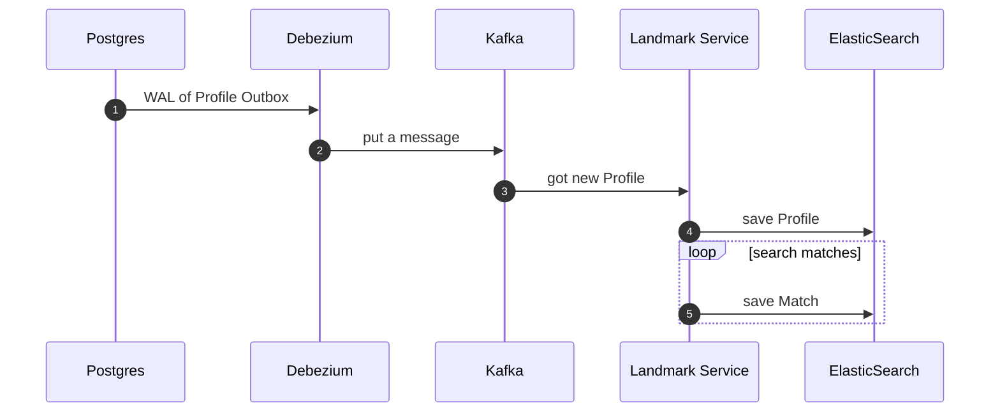
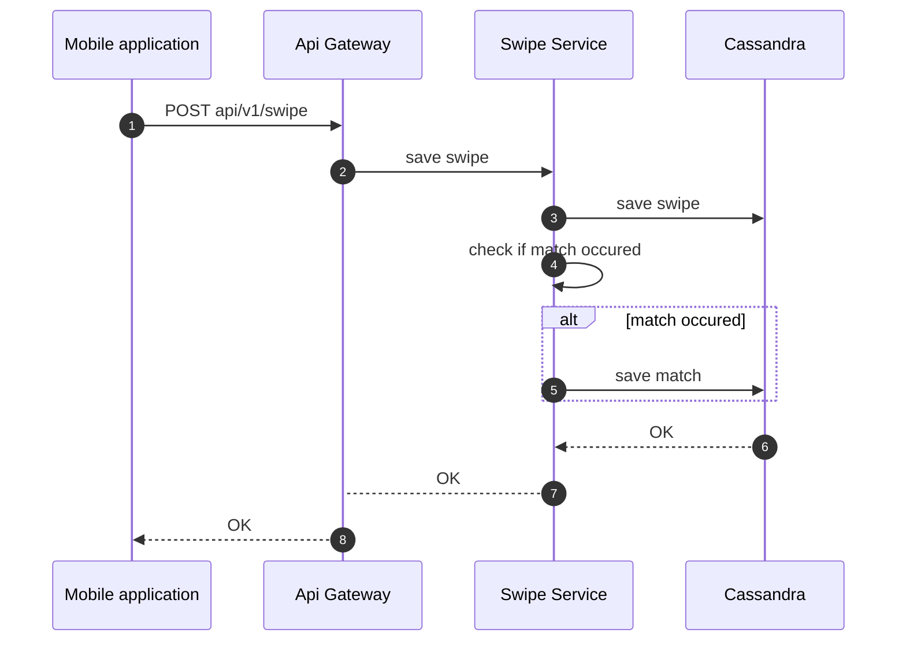

#Soulmate microservices

## Registration

```mermaid
sequenceDiagram
    participant Mobile application
    participant Api Gateway
    participant Keycloak
    participant Profile Service
    participant Face Service
    participant Profile Postgres

    autonumber
    Mobile application->>Api Gateway: POST /v1/auth/registration
    
    Api Gateway->>Keycloak: Request Admin Token
    Keycloak -->>  Api Gateway: admin Token
    
    Api Gateway->>Keycloak: Register
    Keycloak -->>  Api Gateway: Keycloak User

    Api Gateway->>Keycloak: Reset user password
    Keycloak -->>  Api Gateway: Keycloak User

   Api Gateway->>Profile Service: register
   Profile Service ->> Face Service: compute landmarks
   Face Service -->> Profile Service: landmarks
    Profile Service ->> Profile Postgres: save in Profile Table, Outbox Table
    alt Success
         Profile Service -->> Api Gateway : principalId
    else Failed
         autonumber 12
         Profile Service -->> Api Gateway : error
         Api Gateway->>Keycloak: Delete Keycloak User
    end
   
    Api Gateway->>Keycloak: Login
    Api Gateway-->>Mobile application: Access Token
```

```mermaid
sequenceDiagram
    participant Postgres
    participant Debezium
    participant Kafka
    participant Landmark Service
    participant ElasticSearch

    autonumber
    Postgres->>Debezium: WAL of Profile Outbox 
    Debezium ->> Kafka: put a message
    Kafka ->> Landmark Service: got new Profile
    Landmark Service ->> ElasticSearch: save Profile
    loop search matches
        Landmark Service ->> ElasticSearch: save Match
    end

```

## Swipe

```mermaid
sequenceDiagram
    participant Mobile application
    participant Api Gateway
    participant Swipe Service
    participant Cassandra


    autonumber
    Mobile application->>Api Gateway: POST api/v1/swipe
    Api Gateway ->> Swipe Service: save swipe
    Swipe Service ->> Cassandra: save swipe
    Swipe Service ->> Swipe Service: check if match occured
    alt match occured
        Swipe Service ->> Cassandra: save match
    
    end
    Cassandra -->> Swipe Service: OK
    Swipe Service --> Api Gateway: OK
    
    Api Gateway-->>Mobile application: OK

```